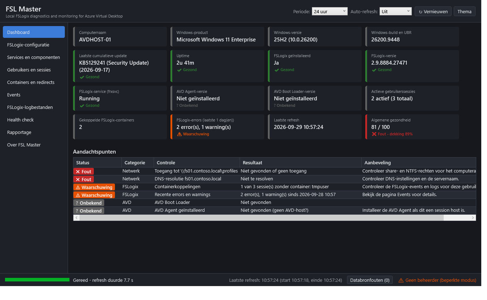
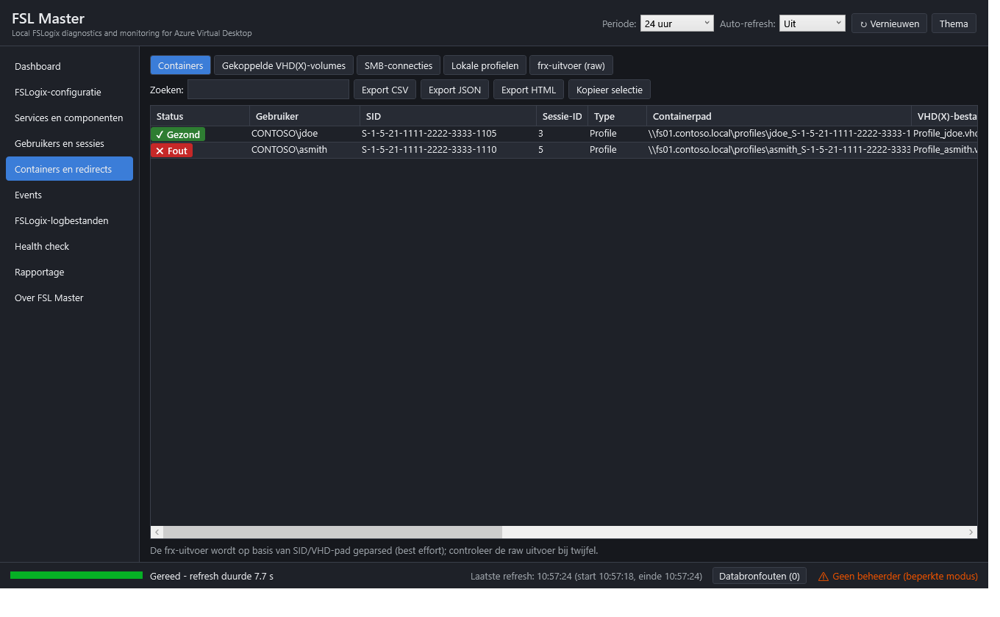
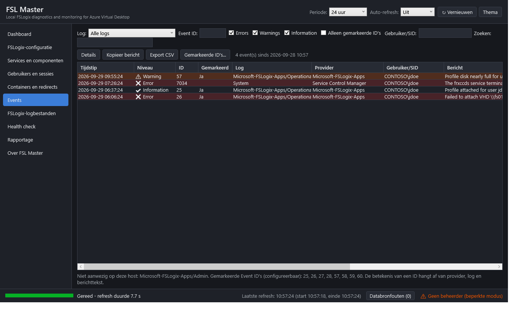
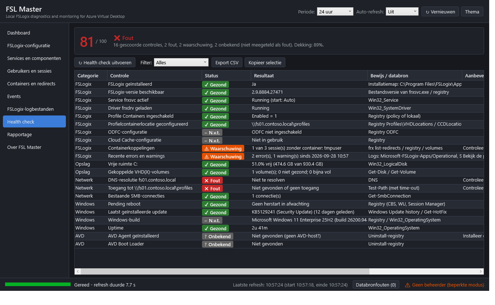
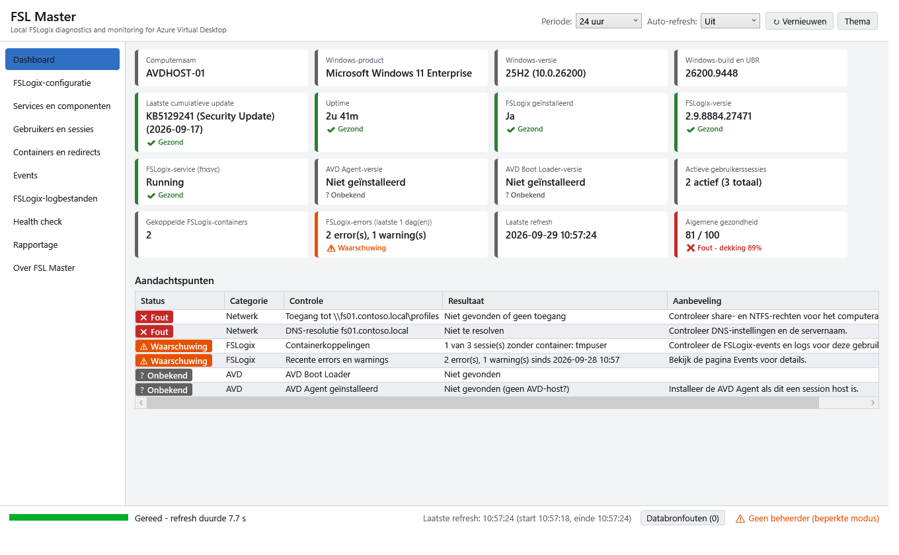

# FSL Master

**Local FSLogix diagnostics and monitoring for Azure Virtual Desktop**

FSL Master is een moderne, portable vervanger voor de oude Microsoft *FRXTray*. Een beheerder start het op een
Windows- of Azure Virtual Desktop-session host en ziet direct de staat van FSLogix op **die ene host**: configuratie,
services, sessies, containers, events, logbestanden en een gezondheidsscore. Standaard is de applicatie **alleen lezend**.



> De schermafbeeldingen in deze repository zijn gemaakt met **synthetische voorbeeldgegevens** (fictieve host `AVDHOST-01`,
> domein `contoso.local`, fictieve gebruikers), omdat de ontwikkelmachine geen FSLogix heeft. Zie
> [Bekende beperkingen](#bekende-beperkingen).

| | |
|---|---|
|  |  |
|  |  |

## Functies

- **Dashboard** – computernaam, Windows-product/versie/build+UBR, laatste cumulatieve update, uptime, FSLogix-versie en -service,
  AVD Agent- en Boot Loader-versie, actieve sessies, gekoppelde containers, FSLogix-errors in de gekozen periode, laatste refresh en
  algemene gezondheid. Ontbrekende onderdelen worden als *Niet geïnstalleerd* / *Niet beschikbaar* getoond – nooit een crash.
- **FSLogix-configuratie** – Profiles, ODFC en Cloud Cache uit `HKLM\SOFTWARE\FSLogix` en `HKLM\SOFTWARE\Policies\FSLogix`, met
  onderscheid *niet geconfigureerd / lokaal / via policy*, effectieve waarde (policy wint), registerpad, uitleg, beoordeling en
  include/exclude-groepen. Export naar JSON en CSV. Onbekende defaults worden als *Onbekend* getoond, niet verzonnen.
- **Services en componenten** – `frxsvc`, `frxccds`, `frxdrv`, `frxdrvvt`, `frxdrvlt`, binaries en bestandsversies, starttype, procesinfo.
  Optioneel (met bevestiging en logging): service starten/stoppen/herstarten voor `frxsvc` en `frxccds`.
- **Gebruikers en sessies** – lokale sessies via de WTS-API (objectgebaseerd, taalonafhankelijk), `quser.exe` alleen als terugval;
  gebruiker, domein, SID, sessiestatus, aanmeldtijd, inactiviteit, profielpad, tijdelijk-profieldetectie en gekoppelde container.
- **Containers en redirects** – `frx.exe list-redirects`, registry (`Profiles\Sessions`), gekoppelde VHD(X)-volumes, SMB-connecties en lokale
  profielen; grootte/wijzigingsdatum, fileserver/share, volume-health, netwerkcontrole met time-out (*Time-out* i.p.v. hangen).
  Export naar CSV, JSON en HTML.
- **Events** – `Microsoft-FSLogix-Apps/Operational`, `…/Admin`, `Application` en `System` (alleen bestaande logs; ontbrekende logs worden
  gemeld). Filters op periode, ID, log, niveau, gebruiker/SID en vrije tekst; configureerbare gemarkeerde Event ID's
  (standaard 25, 26, 27, 28, 57, 58, 59, 60); detailvenster met kopieerfunctie.
- **FSLogix-logbestanden** – `C:\ProgramData\FSLogix\Logs\{Profile,ODFC,CloudCache}`; nieuwste eerst, alleen het einde van grote bestanden
  wordt gelezen (256 KB – 20 MB), zoeken, filteren op niveau/gebruiker/SID/datum, snelle filters (ERROR, WARN, attach, detach, failed,
  timeout, locked, LoadProfile, VHD, VHDX, Cloud Cache), regels kopiëren en fragment exporteren.
- **Health check** – read-only controles op FSLogix, opslag, netwerk (DNS, poort 445, UNC-toegang), Windows en AVD, met status, resultaat,
  bewijs, aanbeveling, tijdstip en een score van 0–100 ([berekening](#berekening-van-de-gezondheidsscore)).
- **Rapportage** – HTML, JSON, CSV (per onderdeel) en TXT, optioneel als **Sanitized report** (gebruikersnamen, SID's, servernamen,
  domeinnamen en UNC-paden gemaskeerd).
- **Overig** – auto-refresh (uit/30 s/60 s/5 min) zonder overlappende acties, voortgang per databron, foutisolatie per databron,
  donker en licht thema, kopieer-, refresh- en exportknoppen, gestructureerd logboek.

Kleur wordt nooit als enige informatiedrager gebruikt: elke status heeft ook tekst en een pictogram
(✔ Gezond, ⚠ Waarschuwing, ✖ Fout, ? Onbekend, – N.v.t.).

## Systeemvereisten

| | |
|---|---|
| Besturingssysteem | Windows 10/11 (ook multi-session) en Windows Server 2016/2019/2022/2025, 64-bit |
| PowerShell | **Windows PowerShell 5.1** (in-box). PowerShell 7 wordt niet ondersteund |
| Rechten | Lokale administrator (UAC-verhoging) |
| Runtime | .NET Framework 4.x (in-box); geen extra PowerShell-modules of installatie nodig |
| Netwerk | Geen internetverbinding nodig; alleen SMB/DNS naar de eigen containerlocaties |

Getest op: Windows 11 Enterprise 25H2 (build 26200), Windows PowerShell 5.1. Andere Windows-versies zijn niet getest.

## Gebruik van de portable executable

1. Kopieer `fsl-master.exe` (uit `fsl-master.zip`) naar de session host, bijvoorbeeld naar `C:\Tools\FSL-Master`.
2. Controleer de hash: `Get-FileHash .\fsl-master.exe -Algorithm SHA256` tegen `fsl-master.exe.sha256`.
3. Dubbelklik. Windows vraagt UAC-verhoging (de exe heeft het manifest `requireAdministrator`).
4. Klik *Vernieuwen* voor een nieuwe meting of kies een auto-refresh-interval.

Er is geen installatie, geen service en geen registratie in *Programs and Features*. De applicatie schrijft alleen naar:

- `%ProgramData%\FSL-Master\Logs` (terugval: `%TEMP%\FSL-Master\Logs`) – applicatielogboek;
- door de gebruiker gekozen exportlocaties;
- optioneel `fsl-master.config.json` naast de exe (terugval: `%ProgramData%\FSL-Master\config.json`) wanneer de gemarkeerde Event ID's
  worden opgeslagen.

### Waarom administratorrechten?

Zonder verhoging kunnen o.a. `Get-Disk`/`Get-Volume` voor gekoppelde VHD's, `Get-SmbConnection`, service- en driverdetails, het
lezen van FSLogix-logs onder `C:\ProgramData` en het FSLogix-eventlog beperkt of onmogelijk zijn (afhankelijk van uw beveiligingsinstellingen). Wordt de applicatie toch niet-verhoogd
gestart (bron/testmodus), dan meldt ze dat direct en biedt aan opnieuw verhoogd te starten; de niet-verhoogde instantie sluit af.

### Configuratiebestand

`fsl-master.config.json` (alle sleutels optioneel; ontbrekend of ongeldig = standaardwaarden):

```json
{
  "MarkedEventIds": [25, 26, 27, 28, 57, 58, 59, 60],
  "LookbackHours": 24,
  "MaxEvents": 2000,
  "AutoRefreshSeconds": 0,
  "LowDiskWarnPercent": 10,
  "LowDiskErrorPercent": 5,
  "NetworkTimeoutMs": 3000
}
```

De betekenis van een Event ID wordt bewust **niet** aangenomen: de lijst markeert alleen; provider, log en berichttekst blijven leidend.

## Vanuit broncode starten

```powershell
cd C:\apps\fsl-master
.\start-dev.ps1                      # vanuit een verhoogde PowerShell 5.1
.\start-dev.ps1 -AllowNonElevated    # ontwikkel-/testmodus, beperkte gegevens
.\start-dev.ps1 -SelfTest out.json   # headless zelftest, schrijft een JSON-samenvatting
```

## De executable bouwen

```powershell
.\build.ps1
```

Vereist op de ontwikkelmachine: Windows PowerShell 5.1, module **ps2exe 1.0.18** (gepind) en Pester (bij voorkeur). Zie
[docs/building.md](docs/building.md). Output: `dist\fsl-master.exe`, `dist\fsl-master.exe.sha256`, `dist\fsl-master.zip`,
`dist\build-info.json`.

**Verpakking:** alle scripts, de XAML en de logica worden door `build.ps1` tot één script gebundeld en met **PS2EXE** (x64, STA,
`-noConsole`, `-requireAdmin`) tot één portable `fsl-master.exe` gecompileerd. Er zijn geen losse bestanden nodig. Dit is gekozen
omdat de scripts in PowerShell 5.1 blijven (maximale compatibiliteit met AVD-hosts), geen installer nodig is en de bron leesbaar blijft.

## Projectstructuur

```
C:\apps\fsl-master\
├── src\
│   ├── App.ps1                 startpunt (param's, elevatiecontrole, window, wiring)
│   ├── Core\Core.ps1           constanten, resultaatmodel, logging, config, time-outs, exportpad-validatie
│   ├── Collectors\             SystemInfo, FSLogix, Sessions, Containers, Events, Health, Collect (orchestrator)
│   ├── Export\Report.ps1       sanitizing, rapportmodel, JSON/CSV/HTML/TXT
│   └── UI\                     MainWindow.xaml en Ui.ps1 (WPF-helpers)
├── tests\FslMaster.Tests.ps1   Pester-tests
├── build\                      hulpscripts (icoon, BOM), werkmap
├── dist\                       buildresultaat (niet in Git)
├── assets\                     icoon
├── docs\                       architecture, building, security, troubleshooting, screenshots
├── build.ps1  start-dev.ps1  README.md  CHANGELOG.md  LICENSE
```

## Berekening van de gezondheidsscore

Elke health-check heeft een status en een gewicht. Alleen `Gezond`, `Waarschuwing` en `Fout` worden gescoord:

| Status | Punten |
|---|---|
| Gezond | 1 |
| Waarschuwing | 0,5 |
| Fout | 0 |
| **Onbekend** | *niet meegeteld* – telt dus **niet** als fout |
| **N.v.t.** | *niet meegeteld* |

```
score = afronden( 100 × Σ(gewicht × punten) / Σ(gewicht)  over alle gescoorde checks )
```

- **Gewicht 2 (kritiek):** FSLogix geïnstalleerd, service `frxsvc` actief, Profile Containers ingeschakeld, containerlocatie
  geconfigureerd, SMB-poort 445 naar de fileserver, toegang tot het UNC-pad. Alle overige checks hebben gewicht 1.
- **Algemene status:** *Fout* bij score < 60 of een `Fout` op een kritieke check; anders *Waarschuwing* bij score < 90 of
  minstens één waarschuwing/fout; anders *Gezond*. **Onbekend** als niets gescoord kon worden, de dekking
  (gescoord ÷ niet-N.v.t.) onder 50 % ligt, of FSLogix niet is geïnstalleerd.
- **Drempels:** vrije ruimte < 10 % = waarschuwing, < 5 % = fout (configureerbaar); recente FSLogix-events: 0 = gezond,
  1–9 errors of ≥ 1 warning = waarschuwing, ≥ 10 errors = fout; laatste update > 45 dagen = waarschuwing, > 90 = fout;
  uptime > 60 dagen = waarschuwing.
- De dekking wordt naast de score getoond, zodat een hoge score met veel *Onbekend* niet ten onrechte gerust stelt.

## Bekende beperkingen

- **De ontwikkelmachine had geen FSLogix.** Alle paden waarin FSLogix wél aanwezig is (containers, redirects, FSLogix-eventlogs,
  logbestanden, serviceacties) zijn getest met mocks en synthetische voorbeelden, niet tegen een echte FSLogix-installatie.
  De GUI is wel met synthetische gegevens volledig gerenderd en gecontroleerd.
- **`frx list-redirects` heeft geen gedocumenteerd, stabiel uitvoerformaat.** De parser herkent records via SID, VHD(X)-pad en
  redirect-doel (best effort). De ruwe uitvoer is altijd zichtbaar op de tab *frx-uitvoer (raw)*.
- Welke waarden precies onder `HKLM\SOFTWARE\FSLogix\Profiles\Sessions\<SID>` staan verschilt per FSLogix-versie; daarom worden alle
  waarden gelezen en wordt het VHD(X)-pad op inhoud herkend.
- Default-waarden worden alleen getoond als ze in de Microsoft-documentatie staan; ze kunnen per FSLogix-versie afwijken.
- De gecompileerde `fsl-master.exe` is **niet ondertekend**. Antivirus/EDR of WDAC kan niet-ondertekende (PS2EXE-)executables blokkeren
  of als vals-positief markeren; op de ontwikkelmachine werd het starten van *elke* niet-ondertekende exe geblokkeerd. Onderteken de
  exe met een eigen code-signing-certificaat in beheerde omgevingen.
- Alleen de lokale host; geen multihost, geen remoting, geen historie tussen sessies.
- Cloud Cache: alleen SMB-locaties (`type=smb`) worden op bereikbaarheid getest; Azure Blob-providers niet.
- Ondersteund: Windows PowerShell 5.1. PowerShell 7 is niet getest.

## Securityinformatie

Kort: read-only standaard, alle beheeracties met bevestiging + logging, geen telemetrie, geen runtime-downloads, geen
ExecutionPolicy-bypass, alle HTML-uitvoer geëscaped, exportpaden gevalideerd. Details in [docs/security.md](docs/security.md).

## Troubleshooting

Zie [docs/troubleshooting.md](docs/troubleshooting.md). Logboek: `%ProgramData%\FSL-Master\Logs\fsl-master-<datum>.log`
(via *Over FSL Master* is het pad zichtbaar). Databronfouten zijn per refresh in de statusbalk te openen.

## Privacyverklaring

FSL Master leest uitsluitend gegevens van de lokale computer. Er wordt niets verzonden: **geen telemetrie, geen automatische uploads,
geen verborgen netwerkcommunicatie**. Netwerkverkeer beperkt zich tot DNS-, TCP-445- en bestandstoegang naar de door de eigen
FSLogix-configuratie aangewezen containerlocaties (health check). Rapporten en exports bevatten mogelijk persoonsgegevens
(gebruikersnamen, SID's, paden); gebruik *Sanitized report* voordat u een rapport deelt. Er worden geen wachtwoorden, tokens of
inloggegevens opgeslagen.

## Disclaimer voor productiegebruik

De software wordt geleverd "zoals hij is", zonder garantie (zie [LICENSE](LICENSE)). Serviceacties (stoppen/herstarten van `frxsvc`/
`frxccds`) kunnen actieve gebruikerssessies en profielcontainers verstoren. Test eerst op een niet-productiehost, controleer de
gegevens in het licht van uw eigen FSLogix-configuratie en gebruik de uitkomsten als hulpmiddel, niet als enige waarheid.

## Licentie

[MIT](LICENSE) – https://github.com/WayToWild/fsl-master
